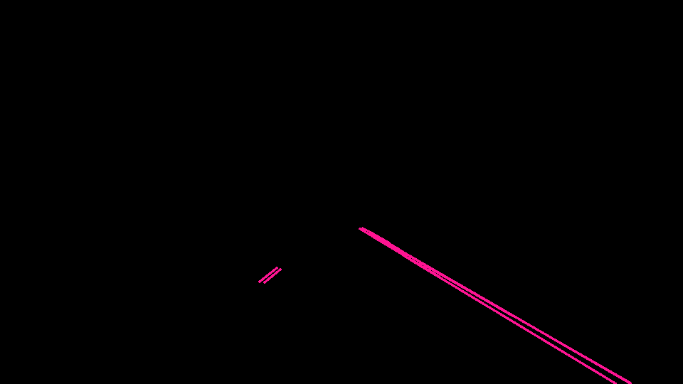
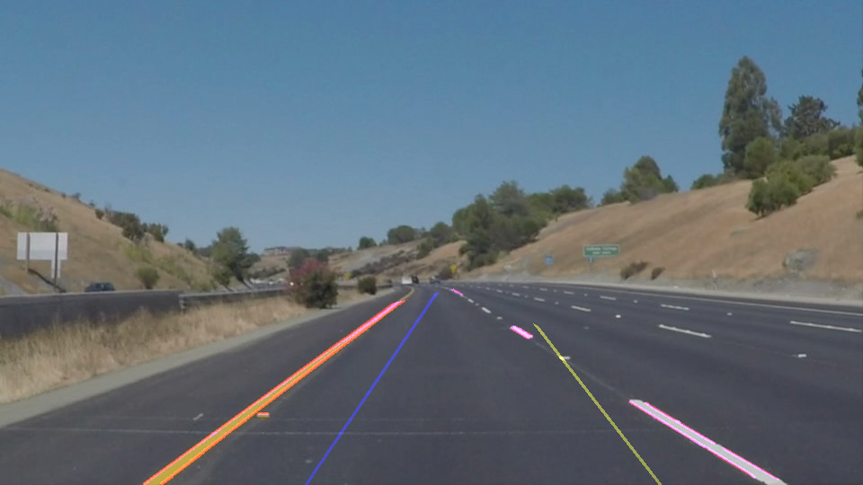

# **Finding Lane Lines on the Road** 

## Writeup Template

### You can use this file as a template for your writeup if you want to submit it as a markdown file. But feel free to use some other method and submit a pdf if you prefer.

---

**Finding Lane Lines on the Road**

The goals / steps of this project are the following:
* Make a pipeline that finds lane lines on the road
* Reflect on your work in a written report

[//]: # (Image References)

[image1]: ./examples/grayscale.jpg "Grayscale"

---

### Reflection

### 1.  Describe your pipeline:

#### My pipeline consisted of 6 steps.  
   Started with the original image: 

*  First, I converted the original images to grayscale, so that I can apply Canny algorithm.

*  Second, applied Gaussian filter to grayscaled image to filter-out noise and spurious gradients.

*  Third, applied the apply canny algorithm on the above image.

*  Fouth, 
created polygon mask.

created a masked image.

created a canny masked image. 

 
*  Fifth, calulated Hough lines from canny edges.
 

The hough_lines() function internally calls draw_lines() function to draw the lines to the full extent. The lines returned from hough_lines() function are drawn on the bases of edges/dots returned from canny algorithm. So, basicaly lines will only be drawn on the pixels which has qualified certain threshold of pixel intensity. Therefore, if the current pipeline watches a unbroken any-color lane-lines then it will annotate it, but if it the lane-lines are broken, which they are on roads, then they will only recognise the any-color broken patches. 

Here, **The goal now is to draw a consistent annotation on the lane lines irrespective of whether it is broken or not.** 

>  In order to draw a single annotation on the left and right lanes, I modified the draw_lines() function as follows
>  1. We got an image with hough lines drawn from hough_lines() function. 
>  2. Seperate the left-lane lines & right-lane lines from the lines returned from hough_lines() function. We can perform 
   it by finding slope of each line and checking under the condition whether it's <0 or >0, respectively put the lines
   in left-lane lines, right-lane lines list.
>>   *  **I observed that there were no verticle lines(slope Infinity) detected in any image. But, can't' find a solid reason           for it.
      May be Hough transformation has excluded them because, these lines are parallel to y-axis and will never meet.
      But, I can defend against this point that, these lines could intersect with many other +ve or -ve slope lines,
      then they are significant.**
>>   * **I found few Horizontal lines. I have seperated them into left-lane lines & right-lane lines on the basis of a 
      condition <500 & >500 respectively**
>  3. After finding the left-lane lines & right-lane lines. I followed the follow points. Consider now only left-lane lines
>>   * First find out minimum of all y's.
>>   * Now, Calculate minimum of x for the minimum y, `Oops...!` You do not know Intercept & slope. Follow the below steps:
>>   * Calculate average slope among all left-lane lines,
>>>     *  find the average of all `(x1,y1,x2,y2)` coordinates to get (x1_avg,y1_avg,x2_avg,y2_avg)
>>>     *  Now, calculate `slope_avg = (y2_avg - y1_avg) / (x2_avg - x1_avg)`
>>   * Calculate average Intercept,
>>>      *  `intercept_avg = y1_avg - (slope_avg * x1_avg)`
>>   * Now you have all the tools `x1_avg, y1_avg, slope_avg, intercept_avg` to calculate `minimum of x for minimum y` point          by using:
         `min_x = (y_min - intercept_avg) / slope_avg`
>  4. Now, we have `(min_x, min_y)` among all left-lane lines and we can calculate `(max_x, max_y)` similarly by following the
   above algorithm.
   Next step is to find `(min_x, min_y) & (max_x, max_y)` for right-lane lines from the above steps.
 
*  Sixth, To achive the goal to get a consistent line on both lanes connect & color above lines with cv2.line() function.

Later, made the annotation semi-transpared by using cv2.addWeighted() function.

After implementing the above Twice, I got the below given results:

### 2. Identify potential shortcomings with your current pipeline

One potential shortcoming would be what would happen when ... 

Another shortcoming could be ...

### 3. Suggest possible improvements to your pipeline

A possible improvement would be to ...

Another potential improvement could be to ...
---
### 4. Questions to Evaluator? 

* When I kept the slope condition as  

* The following were the points selected for annotation. 

* The below are the reflections on the image: 

  
  
  
  
  
  

 
 
* When I kept the slope condition as  

* The following were the points selected for annotation. 

* The below are the reflections on the image:   

  
  
  
  
  
  

 
 
Now, I fix the x's and y's manually for annotation to get the following: 
* When I kept the above slope condition as  

* The following were the fixed points selected for annotation. 

* The below are the reflections on the image:   

  
  
  
  
  
  

 
 

**My question to you is,**  
* Why restricting more the slope conditions in 2nd approach has changed the result. Logically, what I was doing in approach 1st is same. When I have restricted the whole area to draw line on the canny-image, then there is no point at all for the inclusion of noise(wrong slopes from anywhere). Then, Why a forum instructor has suggested me to restrict slope.??? 

* I tried my best with this: 
After getting hough lines,here I have both left and right lanes in it.  
> * 1st I seperated them into left and right lanes.( it will be fine, once I get explaination for my 1st question above)
> * Later, I averaged into each category.( I'm okay with this)
> * Finally I fixed manually y's and get x's for each left and right lane.( not okay to fix manually )
> * then I have draw seperate line using these fixed min-max x's and y's for left and right.
 
Why I have to fix them manually, when through logic what I was doing before, that from the pool of left and right lines, I extracted the minimum and the maximum y's(of all y1, y2 's) then
>> * Either, I extracted the corresponding minimum and maximum y's detected from above stem in the list of lists I am maintaining the left/right lines.
>> * or I used slope intercept form to calculate minimum and maximum x's from above y's.
 
IN BOTH OF THE APPROACHES I WAS NOT ABLE TO GET A GOOD ANNOTATION. MOREOVER, I INVESTED A LOT OF TIME IN EXPRESSING MY QUESTION TO FORUM MENTORS/ASSIGNED MENTOR, BUT NEVER GOT A ANSWER.
 
 
IT'S A REQUEST TO THE EVALUATOR TO PLEASE ANSWER THEM, WHICH WILL HELP TO KNOW WHY I WAS WRONG IF I AM..??
